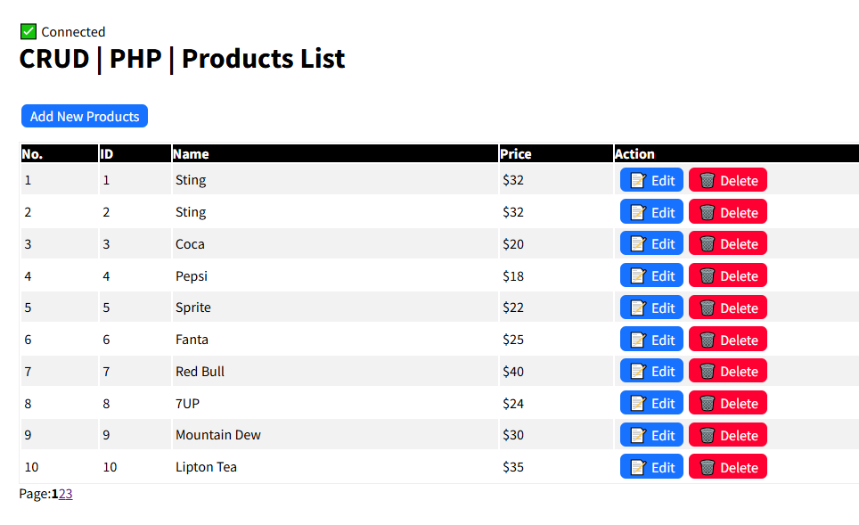

# PHP CRUD

## Requirement

- XAMPP Control Panel v3.3.0

## Install + Setup

- Clone Project: `git clone https://github.com/chhengz/php_crud.git`
- Create new Database: `php_crud` or Drag Drop `php_crud.sql` into your `phpMyAdmin`, It's will be automatically created new Database for you.
- Import SQL File `php_crud.sql` into `localhost/phpmyadmin/index.php?route=/database/import&db=php_crud`

## ScreenShoot

- Home Page

- Add New product

- Edit/Update product

- Delete product (Alert Confirmation)

## Sample Database Connection

<code>

    <?php
        $servername = "localhost";
        $username = "root";
        $password = "";
        $dbname = "php_crud";
        
        // Create connection
        $conn = new mysqli($servername, $username, $password, $dbname);
        
        // Check connection
        if ($conn->connect_error) {
            die("❌ Connection failed: " . $conn->connect_error);
        }
        
        // message to check if the connection is successful
        echo "✅ Connected" . " ";
    ?>

</code>